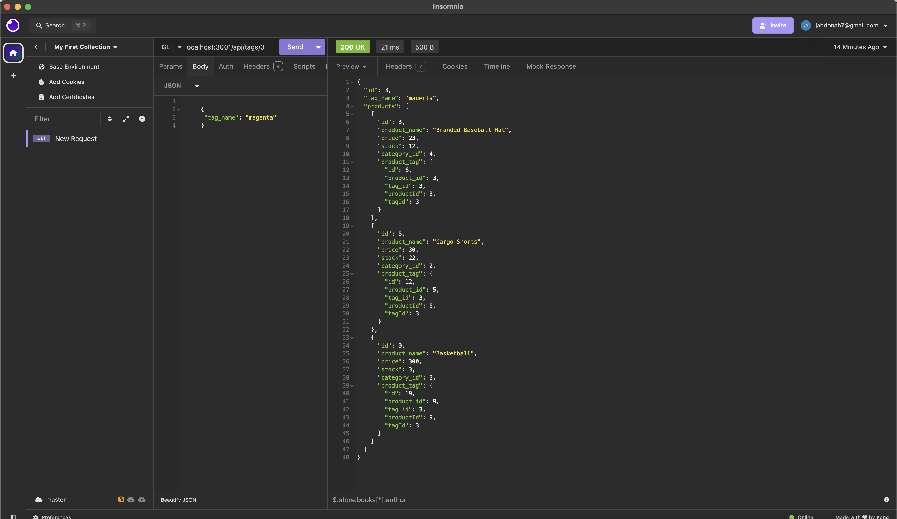

# E-COMMERCE-BACK-END

## Description
```md
Create the back end for an e-commerce site. Configure a working Express.js API to use Sequelize to interact with a PostgreSQL database.
```
## Table of Contents

- [Description](#describution)
- [Table of Contents](#table-of-contents)
- [Installation](#installation)
- [User Story](#user-story)
- [Acceptance Criteria](#acceptance-criteria)
- [Usage](#usage)

- [Authors and Contributors](#authors-and-contributors)
- [License](#license)
- [Test](#test)
- [Github Repository Link](#github-repository-link)
- [Google Drive Link Hosting the video](#google-drive-link-hosting-the-video)
- [Contact Me](#contact-me)

## Installation
```md
This Web Application will be run under INSOMNIA. Installation required will be node so that it will allow to run js (Javascript) 
the requirer version 8.2.4. and PostgreSQL for database management

```
## User Story

```md
AS A manager at an internet retail company
I WANT a back end for my e-commerce website that uses the latest technologies
SO THAT my company can compete with other e-commerce companies
```

## Acceptance Criteria
```md
GIVEN a functional Express.js API
WHEN I add my database name, PostgreSQL username, and PostgreSQL password to an environment variable file
THEN I am able to connect to a database using Sequelize
WHEN I enter schema and seed commands
THEN a development database is created and is seeded with test data
WHEN I enter the command to invoke the application
THEN my server is started and the Sequelize models are synced to the PostgreSQL database
WHEN I open API GET routes in Insomnia for categories, products, or tags
THEN the data for each of these routes is displayed in a formatted JSON
WHEN I test API POST, PUT, and DELETE routes in Insomnia
THEN I am able to successfully create, update, and delete data in my database 
```

## Usage

```md
Open Insomnia, and then create a collection. After creating a collection, you will select your collection and select which method you want test


```
## Mock Up

The following images show the web application's appearance and functionality:

* The image below shows the insomnia testing get method for finding all tags

    


## Authors and Contributors

```md
This Application is designed and implemented by Jean de Dieu Habiyaremye, a 2024 bootcamp students hosted by edx partering with MSU. This application is made possible through different guidance and advice of the Professor Jung and si different Teacher Assistance of the bootcamp
```
## License

```md
This application is under the License of MIT
```

For more details Click on License Badge   

[](LICENSE)
## Github Repository Link

[Github Repository Link](https://github.com/jahdona/E-Commerce-Back-End)

## Google Drive Link Hosting the video

[Google Drive Link Hosting the video](https://drive.google.com/file/d/1B48kqm07e7RRCx6VlzUpDERwmv6CZkVx/view)

## Test

```
In order to run a test type the following comnmnand in terminal: npm test
```
## Contact Me

```md
For further details contact me through phone +1(616)-441-9202 and on my Email: jahdonah@yahoo.com
```

